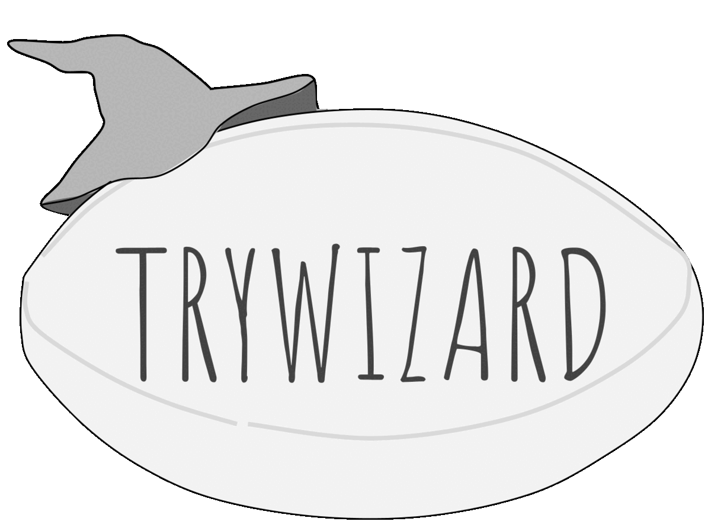

Trywizard a simple 2D rugby manager dashboard game written in `C#` with the Unity game engine that also uses an event-based rugby match simulator written in `Go` (see the [stochadex](https://github.com/umbralcalc/stochadex) package) as a match engine. For more details on how the match engine was created, you can read [this chapter](https://umbralcalc.github.io/diffusing-ideas/managing_a_rugby_match/chapter.pdf) in the open source book: [Diffusing Ideas](https://umbralcalc.github.io/diffusing-ideas/).
